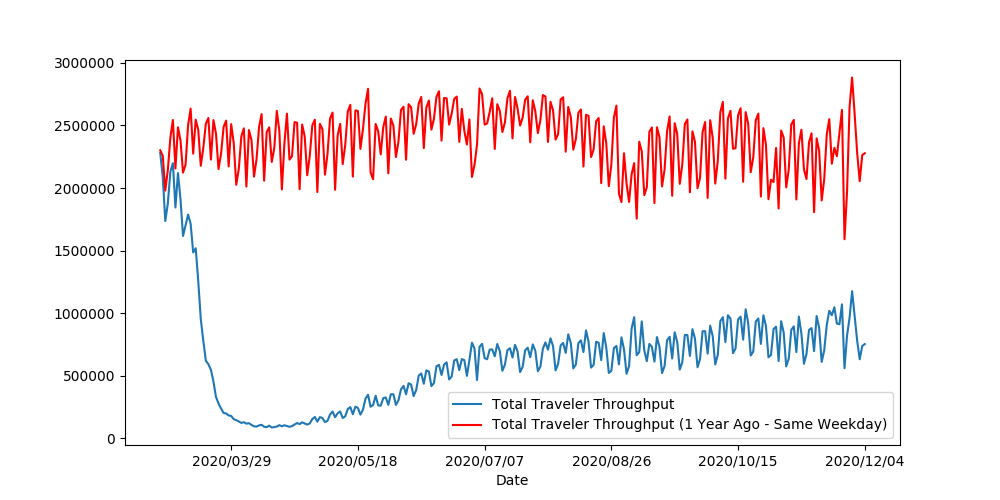

```{r setup, include=FALSE}
knitr::opts_chunk$set(echo = TRUE)
```

# Introduction and motivation


There is no question about what the biggest challenge of the 21st century is: Global climate changes. When we talk about the climate changes, 
it’s important to emphasize that it is the human induced climate changes we are referring to. Some of the climate changes include global warming, 
rising sea levels and irregular downpour. Both the industry and general public is responsible for releasing a high emission of greenhouse gasses 
by e.g. burning fossil fuel. While these effects may not be as visible in your daily life, another byproduct of the increasing pollution is the 
air quality, which influences us more in our daily lives. 

In 2019 the [European Environment Agency](https://www.eea.europa.eu/media/infographics/co2-emissions-from-passenger-transport/view) came out with 
an overview of the amount of CO$_{2}$  emissions of passenger transportation, and it states that 
the emission for traveling with a plane is 285 g CO$_{2}$ per passenger per km, in contrast with an average car where the emission is 55 g of 
CO$_{2}$ per passenger per km.  

One of the first restrictions that most countries made when the covid-19 virus became classified as a pandemic, was travelling restrictions. 
This in theory would dramatically impact the air traffic with both domestic and foreign travel. 

This made us wonder *if the pandemic practically affected the air traffic, did it by default then also affect the air quality?*


# Preperatory work

Before we made a deep dive into the project, we needed to confirm if our suspicion of the decreasing air traffic due to the pandemic was correct. 
We did this by collecting data from the TSA’s (Transport security administration) [website](https://www.tsa.gov/coronavirus/passenger-throughput) 
displaying the traveling throughput at airports in the USA in 2019 and 2020. Figure X shows the plot of this data. As it is possible to see, there 
is a huge decrease in the number of people as of Mars 2020. This is approximately at the same time as Covid-19 caused a lot of countries around the 
world to go into lockdown. 

 

The results we found were quite interesting, and we decided to further investigate the air traffic. We were also interested to see if there were any 
difference between the continents around the world and we therefore picked three different airports from Asia, the USA and Europe to find out more 
about this. 

Since airplanes pollute the air the most per passenger, we further wanted to investigate if the air quality of the respective cities were improved if 
the decrease in air traffic were noticeable high.

The cities and their residing airports we decided to look further into was: Paris (LFPG), England (EGLL), Amsterdam (EHAM), New York (KJFK), Chicago 
(KORD), Los Angeles (KLAX), Delhi (VIDP), Tokyo (RJTT) and Hong Kong (VHHH). These cities and their positions can be seen in figure X.


 


# Related work

### Air traffic
In the preparation phase, we also looked around for other research on how Covid-19 has affected the air traffic. There are several articles and researches
around the internet. 

The articles [“Impact of COVID-19 on worldwide aviation”](https://traffic-viz.github.io/scenarios/covid19.html)  and [“Visualization of Air Traffic during Covid-19 pandemic”](https://towardsdatascience.com/visualization-of-air-traffic-during-covid-19-pandemic-c5941b049401) 
compare and analyse the impact covid-19 has had on aviation, and use methods to analyse and visualize the data similar to what we desire to use. Both 
articles have taken a subset of data from available airports to visualize the global effect the pandemic has had the air traffic. One of the articles 
compares how the passenger traffic by air decreased a lot while the cargo air traffic was not remarkably affected.  

It also looks at how different airlines, and how they individually were affected compared to each other. But in both articles, they conclude that the 
aviation decreased a lot due to the lockdown caused by the pandemic.

### Air pollution
The article [“The short-term impacts of COVID-19 lockdown on urban air pollution in China”](https://www.nature.com/articles/s41893-020-0581-y) have 
measured and analysed the air quality in terms of the AQI (Air quality index) and the concentrations of particulate matter with a diameter of less 
than 2.5 μm (PM2.5). 

After their experiments and analysis, they conclude that there has been a difference in air quality, but it is unknown if it’s only an one-time shock 
where the previous air quality will regress when people resume their normal activity, or if it can have had a stronger and more permanent impact that 
will only be known to us in the future.


# Data collection and preparation

### Preperatory work data
The data we used in our preparatory work was gathered from the TSA website using a web scraping technique with the programming language Python. The 
data was collected and treated before using a library called matplotlib to display it.  

### Flight data 
**(Xavier Olive, Martin Strohmeier, & Jannis Lübbe. (2020). Crowdsourced air traffic data from The OpenSky Network 2020 (Version v20.11) [Data set]. Zenodo. http://doi.org/10.5281/zenodo.4299837) CITE AS THIS ??????**


